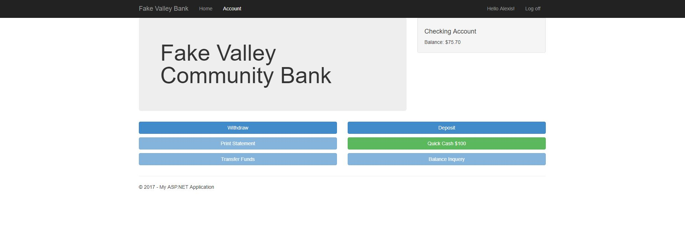

# aspnet-FakeBank
A mock bank website built on the **C# ASP.NET Mvc** framework with a Code-First Database approach. Users have the ability to create an account in order to withdraw, deposit, and check balance of their **FakeBank Valley Bank** Account 


## Models

### Customer Model

The bases of the application is the [Customer](https://github.com/ij2872/aspnet-FakeBank/blob/master/FakeNetBank/Models/Customer.cs) class.
On User Registration,

#### SQL Table

| Id |  AccountNumber  |  FirstName  |  LastName  |  Balance  |  ApplicationUserId  |
|-|-|-|-|-|-|

```csharp
public class Customer
    {
        public int Id { get; set; }
        public string AccountNumber { get; set; }
        public string FirstName { get; set; }
        public string LastName { get; set; }
        public decimal Balance { get; set; }
        public string Name
        {
            get
            {
                return string.Format("{0} {1}", this.FirstName, this.LastName);
            }
        }
        public virtual ApplicationUser User { get; set; }
        public string ApplicationUserId { get; set; }
        public virtual ICollection<Transaction> Transactions { get; set; }
    }
```
Creates the following table


### Creating and Registering a user 

[link to code](https://github.com/ij2872/aspnet-FakeBank/blob/5affebd5486d2c0001ef66c1d4635a24cc6f1cb3/FakeNetBank/Controllers/AccountController.cs#L161-170)
```csharp

        UserManager.AddClaim(user.Id, new Claim(ClaimTypes.GivenName, model.FirstName));

        var db = new ApplicationDbContext();

        var accountNumber = (123459 + db.Customers.Count()).ToString().PadLeft(10, '0');
        var customer = new Customer { FirstName = model.FirstName, LastName = model.LastName,
                                      AccountNumber = accountNumber, Balance = 0, ApplicationUserId = user.Id};
        db.Customers.Add(customer);
        db.SaveChanges();
```
Account numbers are currently based of adding 123459 to the amount of customers located in the Customers Database Table. 
While this method works right now, it may lead to bugs in the future if (and when) users are deleted from the database. Therefore, a new accountNumber generating method will be implemented at a later date.


## Progression 9-11-17



## Notes
At this moment of progression, Users are able to withdraw and deposit. The homepage also allows for the use of Quick cash, an AJax request to the [Transaction Controller](https://github.com/ij2872/aspnet-FakeBank/blob/master/FakeNetBank/Controllers/TransactionController.cs)
